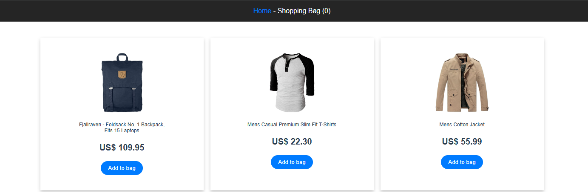

# 🛍️ Vue E-commerce - Shopping Bag

This project is a simple and interactive e-commerce application built using **Vue 3**, **Vuex** for state management, and **Vue Router** for navigation. It uses **Vite** as the development and build tool, offering a fast and efficient setup.

## 📚 Features

- **Vue 3**: Utilizing the latest version of Vue with a modern composition API.
- **Vuex**: State management for storing and managing products.
- **Vite**: Fast development server and build tool.
- **Responsive Design**: The layout is designed to adapt seamlessly to different screen sizes.
- **Dynamic Product Listing**: Fetches product data from a fake API and displays it dynamically.

## 🛠️ Setup Instructions

Follow these steps to set up the project locally:

````bash
# Clone the repository:
git clone https://github.com/agos091/e-commerce-vue.git

# Navigate into the project directory:
cd e-commerce-vue

# Install dependencies:
npm install

# Start the development server:
npm run dev

# Build for production:
npm run build

# Preview the production build:
npm run preview
## 📦 Project Structure

 - src/views: Main view components like HomePage.vue.
 - src/store: Vuex store configuration for state management.
 - src/assets: Static assets such as images and styles.
 - src/App.vue: Main application component.
 - vite.config.js: Configuration file for Vite.

## 🎨 Estilização

 - Uses SCSS for maintainable and organized styling.
 - High-contrast color scheme for readability.
- Responsive design for optimal viewing on all devices.

## 🚀 Tecnologias Utilizadas

- **Vue 3**:  Front-end framework.
- **Vuex**: State management pattern.
- **Vite**: Modern build tool.
- **SCSS**: For advanced styling.
## 📚 Explicação das Principais Funcionalidades

- **Vuex Store**: Manages product data fetched from an API (https://fakestoreapi.com/products). The loadProductsAsync action retrieves and commits data.
- **Computed Properties**: Access products from Vuex and render them dynamically.
- **Imagens Dinâmicas de Fundo**: Uses :style to set images as background-image.


Connect with me on [LinkedIn](https://www.linkedin.com/in/agos-dalcin-rufino-a9913821a/).
🤝 Contributions
Contributions are welcome! If you have any suggestions or want to collaborate, feel free to open an issue or submit a pull request.

A small preview projects:

